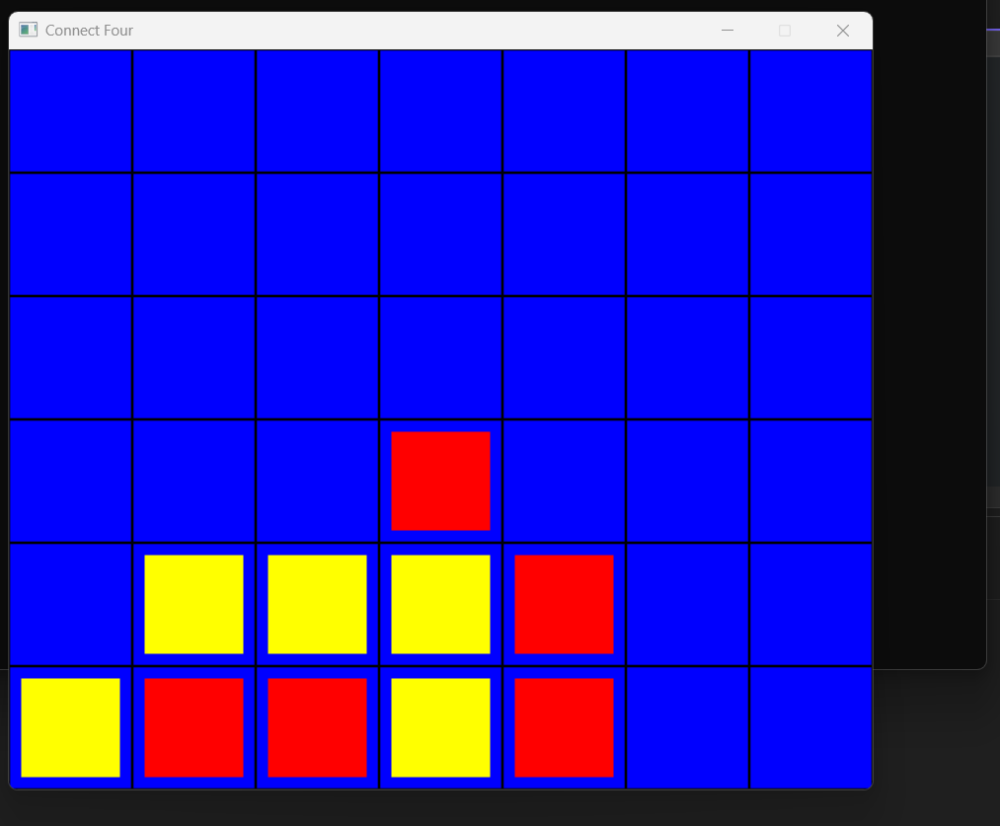

# Project 04 – Connect Four

## 🕹️ Description

This is a turn-based Connect Four game written in C++ using SDL2. Players take turns clicking to drop pieces into columns.

## 🎮 Controls

- Click to drop a piece
- Press `R` to restart
- Press `Esc` to exit

## 🧪 Screenshot

## ✨ Extra Features

- Highlighted winning rows (TODO)
- Restart anytime with `R`
